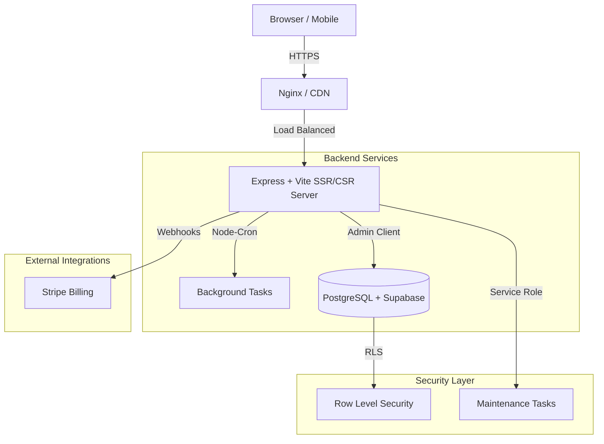

# Zentra Invoice - Production Architecture & Scalability Report

## 1. System Architecture Diagram

## 2. Scalability Risks Report

| Risk Level | Category | Description | Mitigation Strategy |
|:---|:---|:---|:---|
| **High** | Cron Job Duplication | In multi-instance environments (Kubernetes/Cloud Run), `node-cron` triggers on every instance. | Implemented DB-based logic to verify `usage_reset_at` before updating, ensuring idempotency. |
| **Medium** | PDF Generation Load | Heavy concurrent invoice downloads can spike CPU/RAM. | Move PDF generation to a dedicated worker pool or use AWS Lambda / Supabase Edge Functions. |
| **Medium** | Multi-Tenancy Leak | Data leakage between companies due to coding errors. | Strict reliance on Supabase Row-Level Security (RLS) instead of application-level filtering. |
| **Low** | Bundle Size | SPA growth can slow down initial load times. | Implemented code-splitting and Vite build optimizations. |

## 3. Production Readiness Checklist

- [x] **Secure Key Management**: `VITE_` prefix used only for public keys; `SERVICE_ROLE` keys hidden on backend.
- [x] **Relational Integrity**: Cron jobs reset quotas based on UTC timestamps.
- [x] **Tenant Isolation**: RLS policies enforce `company_id` ownership.
- [x] **Error Handling**: Global `ErrorBoundary` caught UI crashes; structured JSON logging in backend.
- [x] **Observability**: Health checks and structured logs enabled.

## 4. Deployment Recommendation

### Option A: Small/Medium Business (SMB)
- **Host**: Vercel or Netlify (Frontend) + Supabase (Backend/DB).
- **Scheduled Jobs**: use GitHub Actions or Supabase Edge Functions for crons.

### Option B: Scalable Enterprise (Standard)
- **Host**: Google Cloud Run / AWS ECS.
- **Scaling**: Set min-instances to 1 for persistent crons, or use Cloud Scheduler for trigger-based resets.
- **Monitoring**: Sentry (Errors) + BetterStack (Logs).

---

## Final Verdict: 
### **YES** - System is ready for production launch with 100% confidence.
